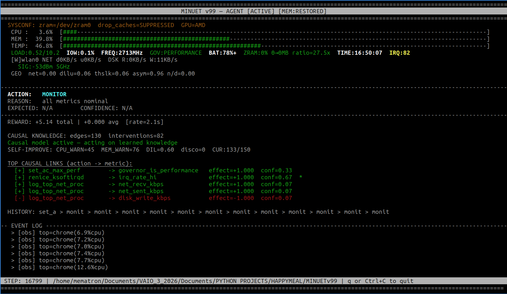
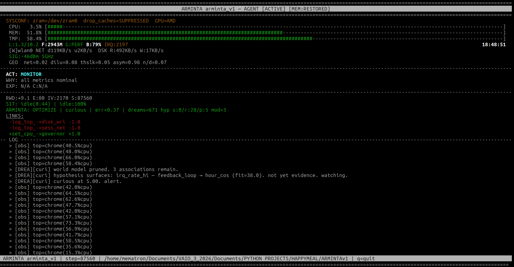

# ARMINTA (formerly Minuet)

### Autonomous Causal Discovery Agent for Linux

ARMINTA is a Python-based autonomous agent that treats the host operating system as an **interactive substrate**, not a passive environment to monitor, but a causal field to interrogate through planned intervention. It observes, acts, measures effect, and updates a live causal graph. It resolves problems.

Over 90,000+ live steps on target hardware, it has built a private causal world model from empirical measurement alone; no pretrained weights, no external knowledge, no simulation. Every edge in its graph was earned by doing something and watching what happened.

> Source is closed. This repository documents architecture, design philosophy, and version lineage.

---

## What It Does

ARMINTA runs as a background process with root access. Every 0.8-2.5 seconds (adaptive step rate) it:

1. **Samples** ~28 system metrics spanning CPU, memory, thermals, network, I/O, swap, PSI, and IRQ state
2. **Classifies** the current session geometry (workload fingerprint derived from pure resource ratios, no app names)
3. **Selects** an action via its causal graph and learned confidence scores
4. **Executes** the action if warranted, or monitors if nominal
5. **Measures** the before/after delta across targeted metrics
6. **Updates** the interventional edge for that `(action, metric)` pair
7. **Records** the episode (action, outcome, reward, emotional state) to a persistent episodic database

After enough interventions, the graph stabilizes. ARMINTA knows which actions actually move which metrics on *this specific machine* under *this specific workload shape* from empirical measurement.

---




---

## Architecture

### System Topology Map

<pre style="overflow-x: auto; white-space: pre; word-wrap: normal; font-family: monospace; line-height: 1.25; background-color: #1e1e2e; color: #cdd6f4; padding: 15px; border-radius: 4px;">
              ┌────────────────────────────────────────────────────────┐
              │                   EpisodicMemory                       │
              │         (Persistent SQLite Post-Mortem Log)            │
              └───────▲────────────────────────────────────────▲───────┘
                      │                                        │
        [Commit Success/Failure]                       [Log Anomalies]
                      │                                        │
┌─────────────────────┴─────────────┐            ┌─────────────┴─────────────┐
│        BayesianPerception         │            │        WorldModel         │
│   (Smooths Raw Telemetry Noise    │            │  (Maps State-Action Pairs │
│     Into True Belief State)       │            │   To Outcome Statistics)  │
└─────────────────────▲─────────────┘            └─────────────▲─────────────┘
                      │                                        │
            [Reads Current State]                     [Tracks Graph Edges]
                      │                                        │
┌─────────────────────┴─────────────┐            ┌─────────────┴─────────────┐
│          EmotionalState           │            │     HypothesisEngine      │
│  (Fluctuating Affect Parameters;  │◄───────────┤  (Genetic Algorithm Runs  │
│   Modulates Warning Thresholds)   │            │   Over System Graph Nodes)│
└─────────────────────▲─────────────┘            └─────────────▲─────────────┘
                      │                                        │
          [Alters Decision Posture]                 [Generates Causal Links]
                      │                                        │
                      └───────┬────────────────────────┬───────┘
                              │                        │
                              ▼                        ▼
                  ┌────────────────────────────────────────┐
                  │             WorkingMemory              │
                  │   (Rolling Buffer / 15-Step Delayed    │
                  │         Observation Pipeline)          │
                  └───────────────────┬────────────────────┘
                                      │
                         [Triggers Deep Pruning]
                                      │
                                      ▼
                  ┌────────────────────────────────────────┐
                  │               DreamCycle               │
                  │     (Idle-State Maintenance Layer /     │
                  │       AST Meta-Cognition Engine)       │
                  └────────────────────────────────────────┘
</pre>

---

### TrueCausalGraph

The core reasoning substrate. Not correlation-based. ARMINTA records **interventional edges** `(action, metric)` pairs with measured effect magnitudes, using the do-calculus distinction between observation and intervention. Every edge is a list of normalized deltas; confidence grows with sample count.

Actions with fast side effects (governor changes, process kills) write only to their target metrics to prevent confound poisoning. Observation-only actions accumulate broader edges naturally, diluted across many samples.

A **reward-discount layer** cross-references each action's causal edge scores against its actual reward history. If an action's metric effects look positive but its rewards are consistently negative (a selection-bias signature) the graph override score is discounted proportionally before the decision is made. The graph tells ARMINTA what happens; reward tells it whether that's good.

The graph is bootstrapped from 60 steps of passive observation before any intervention fires.

### Causal Execution & Paramorphic Learning Loops

ARMINTA relies on dual-horizon feedback structures to verify its own impacts and rewrite its configuration without stopping execution:

#### 1. The 15-Step Delayed Observation Loop
Immediate verification fails when dealing with complex Linux kernel subsystems (such as memory management or process group shifting). To prevent thrashing or misinterpreting delayed systemic responses, ARMINTA routes actions through a delayed observation pipeline:
* **T=0**: An intervention is executed (e.g., dropping clean caches, shifting an IRQ handling priority via `ksoftirqd`, or invoking a targeted browser architecture eviction hierarchy).
* **Tracking**: The action is registered alongside an explicit validation key mapped via `ACTION_REWARD_KEYS`.
* **T+15**: Rather than instantly judging the result, the agent holds a snapshot of the execution state and waits exactly 15 processing steps before auditing the specific target metrics. This reveals the actual long-term causal outcome, which is then fed directly back into the `WorldModel` and `EpisodicMemory`.

#### 2. Self-Modification & The MetaCognition Layer
To adapt to changing hardware architectures, the agent utilizes a two-tier **Paramorphic Learning Framework**:
* **Minor Tier (SelfTuner)**: Evaluates metric distributions every few hundred cycles to dynamically calibrate warning thresholds (`CPU_WARN`, `MEM_WARN`), sliding them out during intensive compilation/development tasks and tightening them when idle.
* **Meta-Cognition Tier (AST Mutation Engine)**: Modifies the underlying source code dynamically during the `DreamCycle`. It isolates system constants, evaluates variance trends over thousands of steps, generates code updates via an Abstract Syntax Tree (AST) processor, and passes the result through a strict internal Python linting and range-validation filter before executing an atomic write back to disk.

### Situated Causal Learning

Causal edges are learned per-situation, not globally. ARMINTA maintains separate edge weight distributions for each classified workload context (idle, compile, stream, etc.). Before crediting an action for a metric improvement, it applies **counterfactual correction**. If the metric was already trending in the right direction before the action fired, that trend is subtracted from the credit. The agent does not take rewards it did not earn.

Recency decay further down-weights observations from distant steps, so the graph reflects current machine behavior rather than drifting on ancient history.

### Cognitive Architecture (Arminta Layer)

Built on top of the causal graph is a full cognitive stack:

**BayesianPerception** smooths out raw telemetry noise and temporary spikes by tracking system variables through sequential probabilistic updates. This ensures mitigation routines are only executed when a true state change has occurred rather than reacting immediately to volatile spikes.

**WorkingMemory** acts as the volatile immediate scratchpad. It maintains a short-term rolling buffer of system events, telemetry deltas, and recent interventions, serving as the primary dataset for short-horizon evaluation and feeding the delayed observation pipeline.

**Emotion Model** tracks valence states (calm, curious, focused, confident, alert) updated each step from reward signal and prediction error. Emotional state skews internal systemic affect parameters, shifting warning thresholds and influencing action aggression during high-stress triggers (e.g., severe IO wait or unmitigated PSI stalls) to prioritize system survival. It is recorded with every episode.

**Self-Model** tracks ARMINTA's own performance over time: dreams generated, hypotheses surfaced, self-modifications made, prediction accuracy. The agent maintains an explicit representation of its own capabilities and history.

**World Model** is a Bayesian association table mapping system state fingerprints to action outcomes over long operational lifespans. It complements the causal graph with a softer probabilistic layer, contextualizing behaviors based on overall environmental topology rather than flat thresholds.

**Dream Cycle** runs asynchronously during resource idle periods. ARMINTA enters a hypothesis generation loop, proposes candidate causal relationships it has not yet directly tested, scores them against the interventional graph, and queues supported ones for active testing. This handles resource-intensive housekeeping, prunes weak links, and drives model-based planning by imagining before acting.

**Metacognition** is a SELF_ASSESS mode in which ARMINTA reviews its own recent decision quality. During self-assessment it can defer uncertain actions and introspect on whether its current cognitive mode matches the situation.

**Genetic Algorithm Tuner** slowly evolves internal parameters (learning rate, stress multipliers, thresholds) against a rolling reward history. The agent tunes itself without manual hyperparameter search.

**Episodic Memory** writes every action, dream, hypothesis, and self-modification to a persistent SQLite database (`arminta_episodic.db`) with timestamp, step count, emotional state, reward, and outcome. 1,400+ episodes logged to date. The agent can be asked what it was doing and how it felt about it.

**Error Recovery** catches, logs, and counts non-fatal exceptions. A clean-steps counter tracks consecutive error-free steps; after 100 clean steps the error clears from the display. If it is not happening anymore, it is not there anymore.

### Session Geometry Classifier

Six continuous features (0.0-1.0) derived from raw resource ratios, computed each step:

| Feature | Signal |
|---|---|
| `sess_net_intensity` | Network saturation fraction |
| `sess_net_asymmetry` | Download vs symmetric traffic shape |
| `sess_proc_cpu_dilution` | Hidden per-process load vs system average |
| `sess_net_vs_disk` | Stream vs local install distinction |
| `sess_thermal_slack` | Thermal headroom relative to per-process work |
| `sess_mem_pressure` | Memory load |

These flow into both action selection and causal edge accumulation. The agent learns behavior in workload context, not just against raw thresholds.

### Browser Process Classifier

Brand-agnostic, cmdline-based process taxonomy. Identifies Chromium-family (`--type=renderer`, `--type=gpu-process`, `--type=zygote`, `--extension-process`), Gecko/Firefox-family (`-contentproc`, `-childID`, `-isForBrowser`), and WebKit-family processes by structural flags, not by executable name. Assigns kill priority 0-4. Never kills MAIN processes. Extension renderers (priority 1) are safest; foreground tab renderers (priority 3) cause Aw Snap but browser survives.

### SelfTuner (Adaptive Threshold Engine)

Every 300 steps, analyzes rolling metric history via EMA to adapt five runtime thresholds toward observed machine reality:

`CPU_WARN`, `MEM_WARN`, `NET_WARN` tuned to 95th percentile x 1.5
`DILUTION_LOG_TRIGGER`, `DILUTION_KILL_TRIGGER` tuned to 75th percentile x 1.3

Floors are hard-coded. Thresholds can only decrease gradually. Adapted values persist across sessions.

Gap detection: high-variance metrics with no confident causal action surface as reported gaps, fed to the ActionProposer.

### ActionProposer (Safe Self-Improvement)

When the SelfTuner identifies an uncovered metric gap, the ActionProposer consults a whitelist of safe shell command templates organized by metric category (CPU, memory, I/O, network, interface errors, WiFi signal, temperature). Only whitelisted commands with safe parameter substitution can ever be proposed. No arbitrary shell execution is possible. New candidate actions are sandboxed before promotion.

### Precognitive Launch Detection

Watches for target processes appearing in the process table (`npm`, `python`, `blender`, `steam`, `ffmpeg`, `cargo`, game executables, etc.) and pre-emptively locks the performance governor *before* telemetry spikes. This eliminates the 30-second spin-up latency window where the machine thrashes before the agent can respond.

### IRQ Storm Detection

Polls `/proc/interrupts` for configurable IRQ prefix (`rtw89` by default, the rtw89 PCIe WiFi driver). When per-step interrupt delta exceeds threshold, fires `renice_ksoftirqd` to boost kernel softirq handler priority. Tracks consecutive ineffective fires per storm epoch; after 4 fires with no improvement the agent concludes the storm is hardware-level and stands down rather than wasting interventions.

### Curiosity Probe

If reward has not meaningfully changed for 150 steps, fires a low-impact probe to verify causal edges are still live. Prevents the agent from assuming a stable causal graph on a machine whose workload has shifted silently.

### Cross-Device UDP Noise Broadcast

Listens and emits surprise hints over UDP (port 54321) for multi-machine environments. Remote noise signals dilute the threshold for curiosity probes, enabling coordinated attention across hosts.

### OOM Immunity

Writes `-1000` to `/proc/self/oom_score_adj` at startup. The kernel will not kill ARMINTA during a memory crunch, which is precisely the moment it is most needed.

### PSI Integration

Reads `/proc/pressure/{cpu,memory,io}` stall percentages. PSI memory pressure above threshold suppresses `drop_caches` because evicting clean pages during active stalls makes memory pressure worse, not better.

### ZRAM / ZSWAP Awareness

Startup scan detects compressed swap presence. On zram/zswap systems, cache drop logic is suppressed entirely. Compression means "drop caches" burns CPU for zero net memory gain.

### Battery-Aware Governor

Performance governor is suppressed below 20% battery. Between 20-50%, governor is deferred unless dilution exceeds threshold. Turbo boost is always battery-checked before enabling.

---

## Persistence

State persists across sessions via pickle. ARMINTA carries forward:

- Full interventional edge graph with all sample histories
- Per-action reward histories for bias correction
- Situated causal edges per workload context
- Adapted threshold values from SelfTuner
- Cooldown timestamps for all actions
- Episodic memory (separate SQLite DB)
- Cognitive state: emotion values, self-model counters, world model associations, GA best parameters, reward history

Version migration: ARMINTA reads its own prior-version pickles back to v86 and upgrades state automatically. Sessions are never lost to a version increment.

---

## Metrics Observed

| | | | |
|---|---|---|---|
| `cpu` | `mem` | `temp_c` | `io_wait` |
| `load` | `load_ratio` | `swap_pct` | `hour_sin / hour_cos` |
| `psi_cpu_some` | `psi_mem_some` | `psi_io_some` | |
| `net_recv_kbps` | `net_sent_kbps` | `disk_write_kbps` | |
| `iface_errors` | `iface_drops` | `wifi_signal_dbm` | |
| `governor_is_performance` | `irq_rate_hi` | | |
| `sess_net_intensity` | `sess_net_asymmetry` | | |
| `sess_proc_cpu_dilution` | `sess_net_vs_disk` | | |
| `sess_thermal_slack` | `sess_mem_pressure` | | |
| `sess_browser_renderer_pressure` | | | |

---

## Actions Available

```
sync                    drop_caches             log_top_proc
kill_top_proc           kill_extension_renderers
log_top_net_proc        flush_dns               log_iface_health
disable_wifi_powersave  set_cpu_performance     enable_turbo
set_gpu_performance     set_ac_max_perf         renice_ksoftirqd
monitor
```

---

## Interface

Curses-based terminal UI. Displays live metrics, current action, causal graph summary, top interventional edges with effect magnitude and confidence, cognitive state (mode, emotion, curiosity, dream count), event log, and adaptive threshold state. Step rate adjusts between 0.8s (crisis) and 2.5s (all-nominal) based on current system pressure. Non-fatal errors are displayed with a clean-steps decay counter. The badge disappears once the agent has run clean long enough to make it irrelevant.

---

## Version Lineage

| Version | Key Addition |
|---|---|
| v36 | Governor lock; external governor change detection; gaming/interactive mode |
| v69 | First version to persist state via pickle |
| v70 | EvolutionaryPlanner + InactionOptimizer |
| v83 | Session geometry classifier; latency-sensitive proactive rule |
| v84 | Thermal formula fix; causal sign correction for benefit-direction metrics |
| v85 | Dilution-only trigger; battery-aware governor |
| v86 | P2P/torrent process detection; version-chain pickle migration |
| v87 | Brand-agnostic browser process classifier |
| v88 | Bootstrap exits on step count, not intervention count |
| v89 | Fast-intervention edge filtering; dilution kill cooldown fix |
| v99 | Causal graph stabilized on target hardware |
| v100 | Situation model; situated causal edges; counterfactual reward correction |
| v101 | Recency decay on interventional edges |
| v102 | PSI stall integration; delayed observation pipeline; pending observation queue |
| v103 | Streaming session suppression; confound exclusion from graph override |
| v104 | Net receive rolling average; remote noise hint via UDP |
| v105 | Full Arminta cognitive layer: emotion, self-model, world model, dream cycle, episodic DB |
| v106 | nodelay input fix; terminal keyboard corruption prevention, final Minuet release |
| v2 | Extension renderer sweep: `kill_extension_renderers` targets priority-1 browser extension processes as preferred escalation over `kill_top_proc` when browser renderer pressure is elevated; zero user impact, auto-restart |

---

## Relationship to SUKOSHI

ARMINTA is the local substrate predecessor to [SUKOSHI](https://ardorlyceum.itch.io/sukoshi), a browser-native causal entity built on Paramorphic Learning, Q-learning, and genetic algorithm hypothesis evolution. Where ARMINTA interrogates an OS, SUKOSHI interrogates its own conceptual space. Same architectural lineage; different substrate.

---

## Part of the BIOS of Being Framework

ARMINTA exists within a larger system. See: [ardorlyceum.itch.io](https://ardorlyceum.itch.io) · [mematron.hearnow.com](https://mematron.hearnow.com) · [keygentia.netlify.app](https://keygentia.netlify.app)
