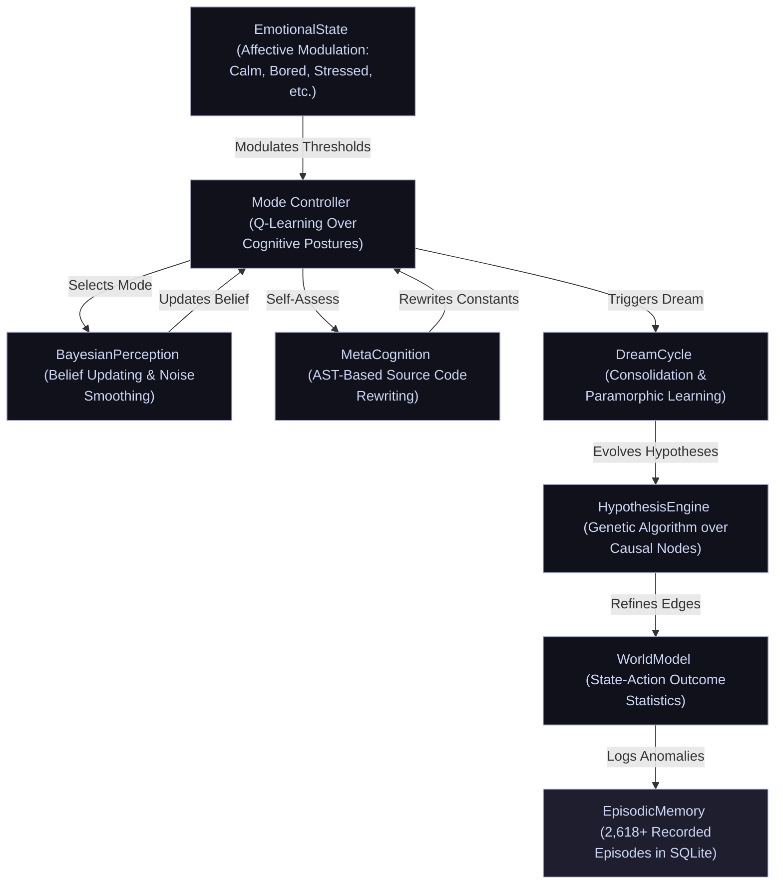

# ARMINTA (formerly Minuet)

### Autonomous Causal Discovery Agent for Linux

ARMINTA is a Python-based autonomous agent that treats the host operating system as an **interactive substrate**. Rather than serving as a passive monitor, it views the OS as a causal field to be interacted with, learned from, and optimized through repeated experimentation. ARMINTA autonomously discovers causal relationships between system actions and performance metrics, maintaining a learnable world model that improves over time.

As of the latest telemetry, ARMINTA has completed **104,115+ live steps** on target hardware. It has constructed a private causal world model derived entirely from empirical measurement; no pretrained models or external heuristics guide its reasoning. The agent operates continuously, learning which system interventions produce measurable improvements across CPU, memory, I/O, thermal, and network dimensions.

> **Source Status**: Closed source. This repository documents the architecture, design philosophy, and version lineage of the ARMINTA engine.

---

## Quick Start

### Prerequisites
- **OS**: Linux (kernel 5.4+)
- **Python**: 3.9+
- **Privileges**: Root access (ARMINTA operates as a privileged background daemon)
- **Dependencies**: Standard system utilities (`sysstat`, `cgroup` tools, Linux PSI support)

### Installation & Deployment
ARMINTA is deployed as a persistent system service. Upon activation:

1. The agent initializes its learned state (or begins with an empty causal graph on first run).
2. It spawns a root-privileged background loop that persists across reboots.
3. Monitoring and intervention metrics are logged to a dedicated SQLite database.
4. The agent's "emotional state" and decision rationale are accessible via episodic logs.

### Observing Behavior
- **Episodic Database**: Query `arminta_episodes.db` for detailed logs of every action, outcome, and self-assessment event.
- **State Snapshot**: The current world model and learned parameters are serialized in a versioned pickle file.
- **System Metrics**: Integration with standard Linux tools (`/proc/meminfo`, `PSI`, thermal sensors) provides ground truth.

---

## Core Operational Loop

ARMINTA operates as a root-privileged background process. Every 0.8 to 2.5 seconds (utilizing an adaptive step rate), it executes the following cycle:

1.  **Sampling**: Collects ~28 system metrics across CPU, memory, thermals, network, I/O, swap, Pressure Stall Information (PSI), and IRQ states.
2.  **Classification**: Derives the current **"Session Geometry"**: a workload fingerprint based on resource ratios rather than process names, enabling context-aware decision-making.
3.  **Cognitive Selection**: Utilizes a high-level **Q-learning Mode Controller** to select an operational posture: `OBSERVE` (passive learning), `INVESTIGATE` (active exploration), `OPTIMIZE` (targeted intervention), `DREAM` (offline consolidation), or `SELF_ASSESS` (introspection and self-modification).
4.  **Action Execution**: Within the chosen mode, the causal graph and learned confidence scores determine which system action (if any) to execute.
5.  **Measurement**: Captures the before/after delta across targeted metrics within a precise 300ms window, isolating causal effects.
6.  **Causal Update**: Updates the interventional edge for the `(action, metric)` pair, applying recency decay and confound filtering to refine confidence estimates.
7.  **Episodic Logging**: Records the complete state (action, outcome, reward, and emotional affect) to a persistent SQLite database for future learning and debugging.

---

## Architecture

### Cognitive Hierarchy

ARMINTA employs a **"double-loop" learning architecture**:

- **High-Level Agent**: A reinforcement learning (RL) controller manages the system's cognitive focus, selecting which mode to enter based on current emotional state and performance targets.
- **Low-Level Engine**: A causal graph engine manages specific system interventions, drawing on learned confidence estimates and the poison registry to avoid harmful actions.

This separation allows the agent to simultaneously optimize long-term strategy while executing precise, safe interventions.

---

### The Dream Cycle: Consolidation & Paramorphic Learning

The **`DREAM` mode** is a critical pillar of ARMINTA's cognitive architecture. It represents the agent's offline processing phase, triggered during system idle periods (low CPU load and low PSI stall pressure, typically during nights or low-activity windows). Dreams are ARMINTA's internal mechanism for consolidating knowledge and evolving its own reasoning.

**Key Components:**

*   **Hypothesis Evolution**: The **HypothesisEngine** runs a Genetic Algorithm over the causal graph. It "imagines" potential links between system states and outcomes, testing them against the episodic history. Successful hypotheses (those that explain past observations) are retained and strengthen the causal model. Failed hypotheses are discarded, pruning impossible causal paths.
*   **Genetic Hyperparameter Optimization**: The **GeneticOptimizer** evolves ARMINTA's own RL parameters (learning rate, discount factor, curiosity weight) against rolling reward history. This allows the agent to meta-learn the optimal balance between exploration and exploitation.
*   **Consolidation**: ARMINTA prunes the world model and clears accumulated prediction errors. This ensures the internal representation remains lean and focused on current system behavior, preventing "catastrophic forgetting" of recent dynamics.
*   **Affective Voice**: Dreaming is logged in ARMINTA's own "voice," providing a window into the agent's internal assessment of its progress and current "emotional" state. Dream logs offer transparency into why the system modified itself or changed its strategy.

---

### TrueCausalGraph & Poison Registry

The reasoning engine is strictly **interventional**, utilizing the distinction between **observation** and **intervention** (do-calculus from causal inference theory).

**Key Mechanisms:**

*   **Interventional Edges**: Every `(action, metric)` pair is stored as a distribution of normalized deltas (before → after). Confidence is weighted by sample count and recency. This allows the agent to answer counterfactual questions like "if I renice process X, how much will memory pressure drop?"
*   **Poison Edge Registry**: To prevent "confound poisoning" (mistakenly believing an action causes an effect when it's actually spurious), the agent maintains a hard-coded registry of structurally impossible causal paths. For instance, `renice_ksoftirqd` is prohibited from affecting network latency, as process priority cannot logically influence network hardware behavior.
*   **Reward-Discount Layer**: If an action's metric effects appear positive (e.g., lower memory pressure) but its rewards are consistently negative (the overall system performance degrades), the graph's recommendation is discounted proportionally. This prevents the agent from optimizing a single dimension at the expense of overall system health.

---

### Advanced Metacognition (Self-Rewriting)

Unlike traditional agents, ARMINTA possesses the ability to modify its own source code. In **`SELF_ASSESS` mode**, the **MetaCognition** module can perform **AST-based rewriting** of the script's own constants and decision thresholds, allowing the agent to improve without external human intervention.

**Self-Modification Safeguards:**

1.  **Validation**: Syntax and linting checks via `ast.parse` ensure any rewritten code is valid Python before execution.
2.  **Atomic Commit**: Safe replacement of the running script on disk with transaction semantics (write to temporary file, then rename).
3.  **Automated Backups**: Retention of versioned `.bak` files for recovery if a self-modification introduces instability.

This capability makes ARMINTA a **true learning system** It refines its weights and refactors its own decision logic.

---

### SelfTuner: Adaptive Threshold Engine

Every 300 steps, the **SelfTuner** analyzes rolling metric history via exponential moving average to adapt five runtime thresholds toward observed machine reality:

- `CPU_WARN`, `MEM_WARN`, `NET_WARN` are tuned to the 95th percentile of recent history, scaled by 1.5
- `DILUTION_LOG_TRIGGER` and `DILUTION_KILL_TRIGGER` are tuned to the 75th percentile, scaled by 1.3

Hard floors are enforced; thresholds can only decrease gradually and never below safe minimums. Adapted values persist across sessions. When the SelfTuner detects high-variance metrics with no confident causal action, it surfaces these as reported gaps and feeds them to the ActionProposer.

---

### ActionProposer: Safe Self-Improvement

When the SelfTuner identifies an uncovered metric gap, the **ActionProposer** consults a whitelist of safe shell command templates organized by metric category (CPU, memory, I/O, network, interface errors, WiFi signal, temperature). Only whitelisted commands with safe parameter substitution can ever be proposed. No arbitrary shell execution is possible. New candidate actions are sandboxed before promotion to the live action set.

---

### Precognitive Launch Detection

ARMINTA watches for target processes appearing in the process table (`npm`, `python`, `blender`, `steam`, `ffmpeg`, `cargo`, game executables, and others) and pre-emptively locks the performance governor before telemetry spikes. This eliminates the spin-up latency window where the machine thrashes before the agent can respond; acting on intent rather than reaction.

---

### IRQ Storm Detection

ARMINTA polls `/proc/interrupts` for a configurable IRQ prefix (defaulting to `rtw89`, the rtw89 PCIe WiFi driver). When the per-step interrupt delta exceeds threshold, it fires `renice_ksoftirqd` to boost kernel softirq handler priority. The agent tracks consecutive ineffective fires per storm epoch; after 4 fires with no measurable improvement it concludes the storm is hardware-level and stands down, avoiding wasted interventions.

---

### Curiosity Probe

If reward has not meaningfully changed for 150 consecutive steps, ARMINTA fires a low-impact probe action to verify that causal edges are still live. This prevents the agent from assuming a stable causal graph on a machine whose workload has silently shifted underneath it.

---

### Cross-Device UDP Noise Broadcast

ARMINTA listens and emits surprise hints over UDP (port 54321) for multi-machine environments. Remote noise signals dilute the threshold for curiosity probes, enabling coordinated attention across hosts without centralized orchestration.

---

### OOM Immunity

At startup, ARMINTA writes `-1000` to `/proc/self/oom_score_adj`. The Linux kernel will not select ARMINTA for termination during a memory crunch, when its intervention is needed the most.

---

### System Integration Details

*   **PSI Safety Interlock**: ARMINTA utilizes Linux **Pressure Stall Information (PSI)** to measure memory and I/O contention. A hard interlock (`PSI_MEM_DROP_CACHES_SUPPRESS = 40.0`) prevents the agent from triggering `drop_caches` when memory PSI stall pressure exceeds 40%, as this could worsen thrashing rather than relieve it.
*   **ZRAM / ZSWAP Awareness**: At startup, ARMINTA scans for compressed swap presence. On systems using zram or zswap, cache drop logic is suppressed entirely. Compression means `drop_caches` burns CPU cycles for zero net memory gain.
*   **Battery-Aware Governor**: Performance governor locking is suppressed below 20% battery. Between 20% and 50%, governor changes are deferred unless process dilution exceeds threshold. Turbo boost is always battery-checked before enabling.
*   **Session Geometry**: Six continuous features (e.g., `sess_net_vs_disk`, `sess_proc_cpu_dilution`) allow the agent to learn context-specific behaviors. It understands that a high CPU load during a video encode is acceptable, but high CPU load during an idle period is anomalous. This enables the agent to distinguish between workload-appropriate system states and genuine problems.
*   **Browser Taxonomy**: A brand-agnostic classifier identifies browser processes by architectural flags (memory footprint, thread count, file descriptor usage patterns). It specifically targets **Extension Renderers** (Priority 1) for escalation, as they can be killed without user-visible data loss. Main browser processes are avoided to prevent session loss.

---

## Persistence & Progress

ARMINTA carries its entire learned history across sessions via a unified state pickle and a dedicated episodic database:

*   **104,115 Steps** of empirical learning on target hardware.
*   **2,618+ Episodes** logged, documenting every major hypothesis, intervention, and self-modification event.
*   **Version-Agnostic Migration**: Automatic state upgrading from prior versions back to Minuet v86, ensuring learned knowledge is never lost during updates.

The persistent state includes:
- **Causal Graph**: Learned `(action, metric)` confidence distributions
- **RL Parameters**: Trained Q-values for cognitive mode selection
- **Episodic Database**: Timestamped records of actions, outcomes, and rewards
- **Self-Model**: Parameters the agent has learned about itself via introspection

---

## Terminology & Key Concepts

| Term | Definition |
|---|---|
| **Session Geometry** | A workload fingerprint derived from resource ratios (CPU%, memory%, I/O%, etc.) rather than process names. Allows context-aware decision-making. |
| **do-calculus** | The mathematical framework for reasoning about causal effects (interventions) vs. mere correlations (observations). |
| **Confound Poisoning** | A spurious causal relationship inferred when an unobserved third variable causes both the action and the observed metric (e.g., load spike causes both process restart and memory drop). |
| **Paramorphic Learning** | Learning not by adjusting weights, but by evolving the structure of the model itself (hypothesis generation and testing). |
| **Poison Registry** | A hard-coded whitelist of impossible causal edges, preventing the agent from learning logically impossible relationships. |
| **PSI (Pressure Stall Information)** | Linux kernel mechanism for measuring I/O and memory contention. Used to detect thrashing and system saturation. |
| **Precognitive Launch Detection** | Process-table monitoring that locks performance governor before a known workload fires, eliminating reaction latency. |
| **IRQ Storm** | A spike in hardware interrupt rate (typically from a WiFi driver) that saturates the softirq handler and degrades system responsiveness. |
| **OOM Immunity** | Protection against Linux kernel out-of-memory termination, ensuring the agent survives the memory crises it is meant to resolve. |

---

## Version Lineage

| Version | Release Date | Milestone |
|---|---|---|
| **Minuet v86** | Early 2024 | Foundation: first persistent causal world model. |
| **Minuet v100** | Mid 2024 | Genetic algorithm integration for hypothesis evolution. |
| **Minuet v105** | Late 2024 | Introduction of full cognitive layer (Emotional State, Self-Model, Episodic Database). |
| **Minuet v106** | Early 2025 | Terminal corruption prevention; final Minuet stability release. |
| **Arminta v1** | Mid 2025 | Rebrand and architectural consolidation. Introduction of SUKOSHI linkage. |
| **Arminta v2** | Current | **Extension Renderer Sweep**: Implementation of Priority-1 browser process targeting, enabling surgical intervention in browser-heavy workloads with zero user-visible impact. |

---

## Known Limitations & Constraints

- **Linux-Only**: ARMINTA is designed exclusively for Linux systems with modern PSI support.
- **Root Privileges Required**: Full system optimization requires root access. Some metrics can be gathered unprivileged, but interventions cannot.
- **Closed Source**: The full implementation is proprietary. This repository documents architecture and philosophy only.
- **Hardware-Specific Learning**: The causal graph is learned on specific hardware. Transfer to different systems requires re-learning, though the agent's architecture is hardware-agnostic.
- **Latency**: System actions have 0.8–2.5 second response times. Not suitable for sub-second performance tuning.

---

## Relationship to SUKOSHI

ARMINTA is the local substrate predecessor to [SUKOSHI](https://ardorlyceum.itch.io/sukoshi), a browser-native causal entity built on Paramorphic Learning and genetic algorithm hypothesis evolution. Where ARMINTA optimizes the Linux kernel and system processes, SUKOSHI applies the same causal discovery and self-modification principles within a browser environment.

---

## Part of the BIOS of Being Framework

ARMINTA exists within a larger system of autonomous agents and cognitive frameworks. For more context, see:

- **[ardorlyceum.itch.io](https://ardorlyceum.itch.io)** —> BIOS of Being registry, interactive terminal, and related projects
- **[mematron.hearnow.com](https://mematron.hearnow.com)** —> *BIOS_OS: The Sonification Cycle*: the 24-track audio tier of the BIOS of Being system
- **[keygentia.netlify.app](https://keygentia.netlify.app)** —> Keygentia Taxonomy Engine: an AI classification tool and Node 03 of the BIOS_OS project

---

## License & Attribution

ARMINTA is closed-source software. This repository, including all architecture documentation, diagrams, and design specifications, serves as a public record of the engine's design philosophy and evolution, and remains the intellectual property of [Jason German (mematron)](https://github.com/mematron).

Redistribution or reproduction of this documentation without attribution is not permitted. For inquiries about licensing, deployment, or collaboration, contact the author via GitHub or through the BIOS of Being project at ardorlyceum.itch.io.

---

**Last Updated**: May 2026  
**Maintainer**: [Jason German (mematron)](https://github.com/mematron)
